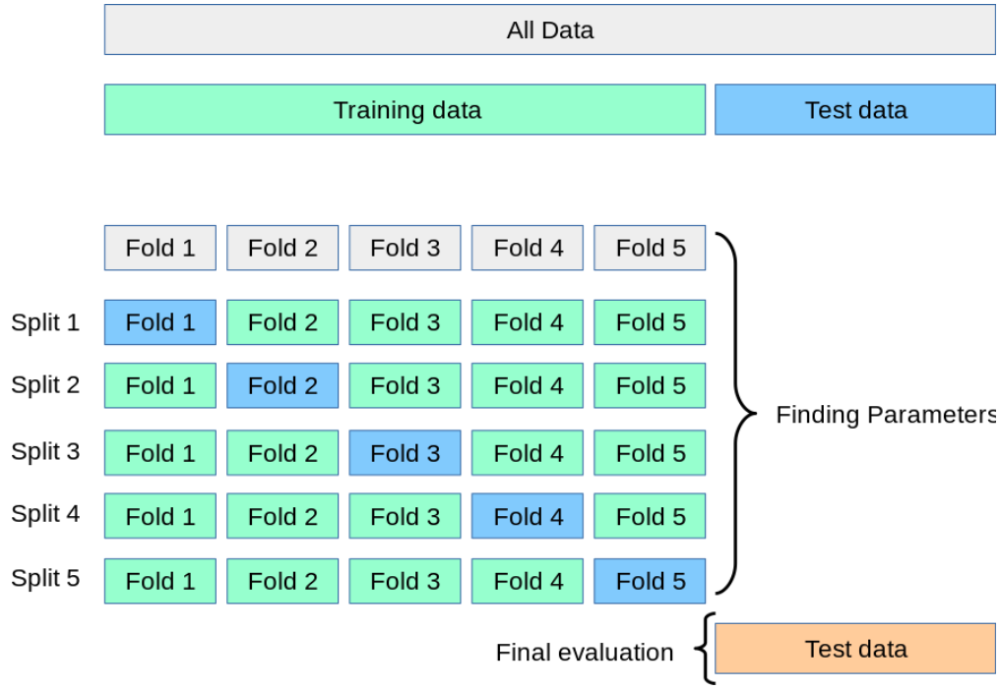
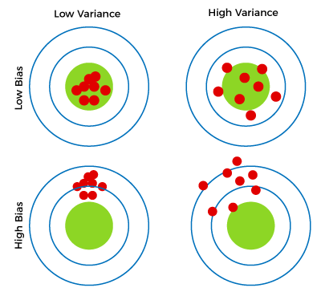
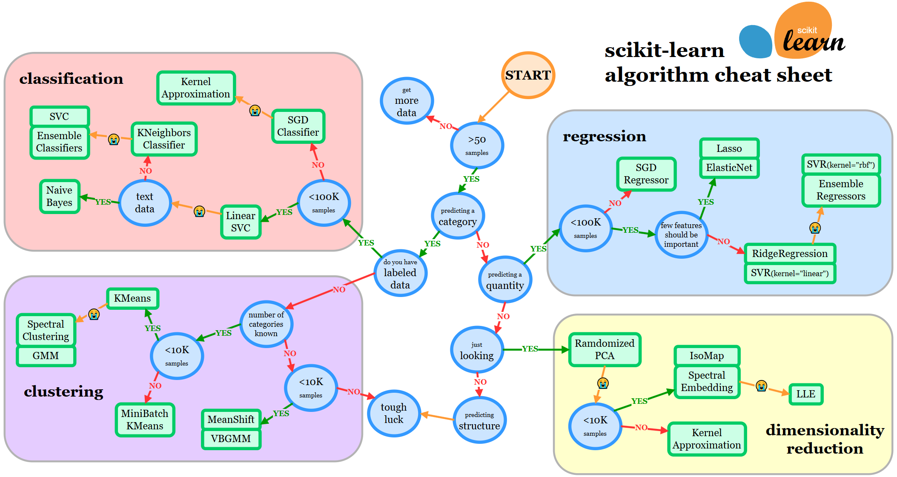

# Chapter 1: Fundamentals of Machine Learning


In this chapter, we will
- review fundamental concepts in ML 
- will compare supervised and unsupervised learning
- discuss uses of training, testing, and validation data
- describe applications of ML
- discuss performance measures that can be used to assess ML systems
- introduce scikit-learn, and install tools required in subsequent chapters


## 1.1 Defining machine learning

**Machine learning** is the design and study of software artifacts that use past experience to inform future decisions, that is, ML is the study of programs that learn from data.
The fundamental goal of ML is to generalize, or to induce an unknown rule from examples of rule's application.


## 1.2 Learning from experience

ML systems are often described as learning from experience either with or without supervision from humans, and is generally categorized into three main types based on nature of learning process and kind of data available.

**Supervised Learning**
- In supervised learning, **model is trained on a labeled dataset**, where each input is paired with its corresponding output.
    - model learns to map inputs to outputs by minimizing prediction errors
- Applications:
    - Regression (*e.g.*, predicting house prices, stock prices)
    - Classification (*e.g.*, email spam detection, image recognition)
- Example Algorithms
    - linear regression, logistic regression
    - support vector machines (SVMs)
    - decision trees
    - neural networks

**Unsupervised Learning**
- In unsupervised learning, **model works with unlabeled data**.
    - it tries to find hidden patterns or intrinsic structures within the data without specific guidance on what to predict
- Applications:
    - clustering (*e.g.*, customer segmentation, grouping similar products)
    - dimensionality reduction (*e.g.*, Principal Component Analysis for feature reduction)
- Example Algorithms:
    - K-means clustering
    - hierarchical clustering
    - autoencoders, t-SNE

**Reinforcement Learning**
- In reinforcement learning, **an agent learns by interacting with an environment**.
    - it takes actions to maximize cumulative rewards based on feedback (rewards or penalties) from environment
- Unlike supervised learning, reinforcement learning programs do not learn from labeled pairs of inputs and outputs.
    - instead, they receive feedback for their decisions, but errors are not explicitly corrected.
    - *i.e.*, a reinforcement learning program that is learning to play a side-scrolling video game like Super Mario Bros may receive a reward when it completes a level or exceeds a certain score, and a punishment when it loses a life.
    - however, this supervised feedback is not associated with specific decisions to run, avoid Goombas, or pick up fire flowers.
- Applications:
    - Game AI (*e.g.*, AlphaGo)
    - Robotics (*e.g.*, teaching robots to navigate or manipulate objects)
    - Autonomous systems (*e.g.*, self-driving cars)
- Example Algorithms:
    - Q-learning
    - deep Q-networks (DQN)
    - policy gradient methods


Supervised learning and unsupervised learning can be thought of as occupying opposite ends of a spectrum. In addition, there are emerging categories and techniques:
- **Semi-Supervised Learning**: Combines a small amount of labeled data with a large amount of unlabeled data to improve learning efficiency.
- **Self-Supervised Learning**: A subset of unsupervised learning where the system generates its own labels from raw data, often used in NLP and computer vision.
- **Online Learning**: Models learn incrementally as new data becomes available, often used in real-time systems.
- **Federated Learning**: Training models across decentralized devices while maintaining data privacy.

For supervised learning program, **output is referred to response variable** (it has other names, like *dependent variables*, *regressands*, *criterion variables*, *measured variables*, *responding variables*, *explained variables*, *outcome variables*, *experimental variables*, *label*, and *output variables*). **Input variables as features**, and **phenomena they represent as explanatory variables** (other names include *predictors*, *regressors*, *controlled variables*, and *exposure variables*).


## 1.3 Machine learning tasks

Two of the most common supervised ML tasks are **classification** and **regression**.
- In classification tasks, program must learn to predict discrete values for one or more response variables from one or more features.
    - that is, program must predict most probable category, class, or label for new observations.
    - applications of classification include predicting whether a stock's price will rise or fall, or deciding whether a news article belongs to the politics or leisure sections.
- In regression problems, program must predict the values of one more or continuous response variables from one or more features.
    - examples of regression problems include predicting sales revenue for a new product, or predicting salary for a job based on its description.
    - like classification, regression problems require supervised learning.

For unsupervised learning tasks
- a common is to discover groups of related observations, called clusters, within the dataset.
    - this task, called **clustering**, assigns observations into groups such that observations within a groups are more similar to each other based on some similarity measure than they are to observations in other groups.
    - **Clustering** is often used to explore a dataset.
    - *i.e.*, given a collection of movie reviews, a clustering algorithm might discover the sets of positive and negative reviews.
    - system will not be able to label clusters as positive or negative;
    - without supervision, it will only have knowledge that grouped observations are similar to each other by some measure.
    - a common application of clustering is discovering segments of customers within a market for a product.
    - by understanding what attributes are common to particular groups of customers, marketers can decide what aspects of their campaigns to emphasize.
    - clustering is also used by internet radio services; given a collection of songs, a clustering algorithm might be able to group songs according to their genres.
    - using different similarity measures, same clustering algorithm might group songs by their keys, or by instruments they contain.
- **Dimensionality reduction** is another task that is commonly accomplished using unsupervised learning.
    - some problems may contain thousands or millions of features, which can be computationally costly to work with.
    - additionally, program's ability to generalize may be reduced if some features capture noise or are irrelevant to underlying relationship.
    - **dimensionality reduction** is process of discovering features that account for greatest changes in response variable.
    - dimensionality reduction can be used to visualize data.
        - it is easy to visualize a regression problem such as predicting price of a home from its size; home size can be plotted on graph's x axis, and home price can be on y axis.
        - it is similarly easy to visualize housing price regression problem when a second feature is added;
        - number of bathrooms in house could be plotted on z axis
    - a problem with thousands of features, however, becomes impossible to visualize


## 1.4 Training data, testing data, and validation data

The collection of examples that comprise supervised experience is called a **training set**, and that used to assess performance is called a **test set**.

A program that generalizes well will be able to effectively perform a task with new data.
- in contrast, a program that memorizes training data by learning an overly-complex model could predict values of response variable for training set accurately, but will fail to predict value of response variable for new examples.
- memorizing the training set is called **overfitting**.
- balancing generalization and memorization is a problem to many ML algorithms, which can be solved via **regularization**.

In addition to training and test data, a third set of observations, called a **validation or hold-out set**, is sometimes required.
- **Validation set is used to tune variables called hyperparameters** that control how algorithm learns from training data.
- Validation set should not be used to estimate real-world performance because program has been tuned to learn from training data in a way that optimizes its score on validation data.

==It is common to partition a single set of supervised observations into training, validation, and test sets==.

When training data is scarce, a practice called **cross-validation** can be used to train and validate a model on same data.
- in cross-validation, training data is partitioned.
    - model is trained using all but one of partitions, and tested on remaining partition.
- partitions are then rotated several times so that model is trained and evaluated on all data.
- the following diagram depicts cross validation with 5 partitions folds.
    - original dataset is partitioned into 5 folds of equal size labeled Fold 1 through Fold 5.
    - initially model is trained on partitions Fold 2-5, and tested on F1
    - in next iteration (split), model is trained on partitions F1, F3-5, and tested on F2
    - partitions are rotated until models have been trained and tested on all partitions. 
- Cross-validation provides a more accurate estimate of model's performance than testing a single partition of data.




## 1.5 Bias and variance

Many metrics can be used to measure whether or not a program is learning to perform its task more effectively. For supervised learning problems, many performance metrics measure the amount of prediction error.
- There are two fundamental causes of prediction error: a model's **bias** and its **variance**.
    - Assume you have many training sets that are all unique, but equally representative of population.
- A model with high bias will produce similar errors for an input regardless of training set it used to learn; model biases its own assumptions about real relationship over relationship demonstrated in training data.
- A model with high variance, conversely, will produce different errors for an input depending on training set that it used to learn.
- A model with high bias is inflexible, but a model with high variance may be so flexible that it models noise in training set.
    - That is, a model with high variance over-fits training data, while a model with high bias under-fits training data.
- It can be helpful to visualize bias and variance as darts thrown at a dartboard.
    - Each dart is analogous to a prediction, and is thrown by a model trained on a different dataset every time.
    - A model with high bias but low variance will throw darts that will be tightly clustered, but could be far from bulls-eye.
    - A model with high bias and high variance will throw darts all over board; darts are far from bulls-eye and from each other.
    - A model with low bias and high variance will throwndarts that could be poorly clustered but close to bulls-eye.
    - A model with low bias and low variance will throw darts that are tightly clustered around bulls-eye.



Ideally, a model will have both low bias and variance, but efforts to decrease one will frequently increase the other. This is known as **bias-variance trade-off**.

Machine learning systems should be evaluated using **performance measures** that represent costs associated with making errors in real world, but this applies to some but not all application.
- For supervised ML, most performance measures can only be calculated for a specific type of task, like classification or regression. 
- Unsupervised learning problems do not have an error signal to measure; instead, **performance metrics** for unsupervised learning problems measure some attribute of structure discovered in data, such as distances within and between clusters.


## 1.6 An introduction to Scikit-learn

Since its release in 2007, [**scikit-learn**](https://scikit-learn.org/) has become one of the most popular machine learning libraries.
- Scikit-learn is built on popular NumPy and SciPy.
    - NumPy extends Python to support efficient operations on large arrays and multi-dimensional matrices.
    - SciPy provides modules for scientific computing.
    - Matplotlib is often used for data visualization.
- Scikit-learn provides algorithms for ML tasks including classification, regression, dimensionality reduction, and clustering
- It also provides modules for pre-processing data, extracting features, optimizing hyperparameters, and evaluating models.

```python
import sklearn
print(sklearn.__version__)
```

The easiest way to install scikit-learn is to use `pip`:
```python
$ pip install -U scikit-learn
```

If `pip` is not available on your system, you can use `conda` and consider to create a python virtual environment to store all packages and libraries.



:::danger
:::
