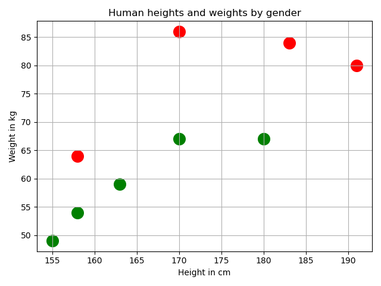

# Chapter 3: Classification and Logistic Regression with k-Nearest Neighbors

In this chapter, we will introduce `k-Nearest Neighbors (KNN)` algorithm for classification and logistic regression tasks.

## 3.1 k-Nearest Neighbors

kNN is a simple model for regression and classification tasks.
- The titular neighbors are representations of training instances in a **metric space**, which is a feature space in which contains distances between all members in a data set.
- These neighbors are used to estimate value of response variable for a test instance.
- The **hyperparameter k** specifies how many neighbors can be used in estimation.
	- A hyperparameter is a parameter that controls how algorithm learns;
	- hyperparameters are not estimated from training data and are sometimes set manually.
	- The final k neighbors selected are those that are nearest to test instance, as measured by some distance function.

For classification tasks, a set of tuples of feature vectors and class labels comprise training set.
- kNN is a capable of binary, multi-class, and multi-label classification.
- The simplest kNN classifiers use mode of kNN labels to classify test instances, but other strategies can be used.
- `k` is often set to an odd number to prevent ties.
- In regression tasks, feature vectors are each associated with a response variable that takes a realvalued scalar instead of a label. The prediction is mean or weighted mean of kNN response variables.

## 3.2 Lazy learning and non-parametric models

kNN is a **lazy learner** (known as **instance-based learners**), it simply store training dataset with little or no processing.
- In contrast to **eager learners** (such as **simple linear regression**), kNN does not estimate parameters of a model that generalizes training data during a training phase.
- Lazy learning has advantages and disadvantages.
	- Training an eager learner is often computationally costly, but prediction with resulting model is often inexpensive.
		- For simple linear regression, prediction consists only of multiplying learned coefficient by feature, and adding learned intercept parameter.
	- A lazy learner can predict almost immediately, but making predictions can be costly.
		- In simple implementation of kNN, prediction requires calculating distances between a test instance and all training instances.

In contrast to most of other models that we will discuss, **kNN is a non-parametric model**.
- A parametric model uses a fixed number of parameters, or coefficients, to define the model that summarizes the data.
	- The number of parameters is independent of number of training instances.
- Non-parametric may seem to be a misnomer, as it does not mean that the model has no parameters;
	- Non-parametric means that number of parameters of model is not fixed, and may grow with number of training instances.
	- Non-parametric models can be useful when training data is abundant and you have little prior knowledge about relationship between response and explanatory variables.
		- kNN makes only one assumption: instances that are near each other are likely to have similar values of response variable.
		- This flexibility provided by non-parametric models is not always desirable;
	- A model that makes assumptions about the relationship can be useful if training data is scarce or if you know relationship.

## 3.3 Classification with kNN

Tutorial **1-height-weight-gender** using a person's height and weight (two explanatory variables) to predict gender (response variable).
- This is called **binary classification** because response variable can take one of two labels.
- kNN is not limited to two features as kNN algorithm can use an arbitrary number of features, but more than three features cannot be visualized.
- Male denoted by red O and female denoted by green markers.

### 3.3.1 Prediction using Euclidean distance

Let's use **Euclidean distance** to predict whether a person with a given height (155 cm) and weight (70 kg) is a man or a woman. 
- First define distance measure.
	- **Euclidean distance** = the straight distance between points in a Euclidean space. 
	- Euclidean distance in a two-dimensional space is given by formula $d(p,q) = d(q,p) = \sqrt{(q_1-p_1)^2 + (q_2-p_2)^2}$
	- Cal distance between test point to all other points
- Set $k=3$ and select 3 (marked as `x` in figure) nearest training instances
	- blue O is test point
	- 2 neighbors are female and 1 is male. We therefore predict that test instance is female

:::danger
:::
