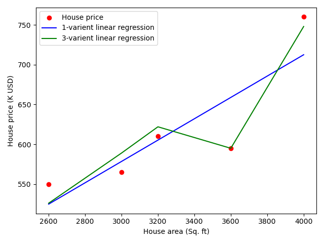
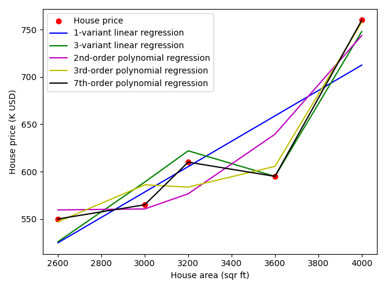

# Chapter 5: From Simple to Multiple Linear Regression

- In [Chap. 2, Simple Linear Regression](../chap-02-simple-linear-regression/chap-02-simple-linear-regression.md), we used simple linear regression to model relationship between a single explanatory variable and a continuous response variable.
- In [Chap. 3, Classification and Regression with K-Nearest Neighbors](../chap-03-classification-logistic-regression-with-kNN/chap-03-classification-logistic-regression-with-kNN.md), we introduced kNN and trained classifiers and regressors that use more than one explanatory variable to make predictions.
- In this chapter, we discuss a multiple linear regression, a generalization of simple linear regression that regresses a continuous response variable onto multiple features.
	- we first analytically solve values of parameters that minimize RSS cost function.
	- we then introduce a powerful learning algorithm that can estimate values of parameters that minimize a variety of cost functions, called gradient descent.
	- we then discuss polynomial regression, another special case of multiple linear regression, and learn why increasing model’s complexity can increase risk that it fails to generalize.

## 5.1 Multiple linear regression

In previous chapter, we introduced a simple linear regression model. How to improve it?
- consider factors affecting house's price, no. of rooms, which can be 2nd explanatory variable
- we use a multiple explanatory variables called **multiple linear regression** given by $y = b+ w_1*x_1 + w_2*x_2 + ... + w_n*x_n$
- this model for linear regression can be written in vector notation $Y = WX$
	- which is equivalent to multiple simple linear regression
	- y is a column vector of values of response variables for training examples
	- β/w is a column vector of values of model's parameters
	- X, sometimes called **design matrix**, is an *m \* n* dimensional matrix of values of explanatory variables for training examples
		- m is number of training examples
		- n is number of features

We update training and test data to include number of rooms and age of house
- learning algorithm must estimate values of three parameters: coefficients for two features and intercept term
- we directly solve model parameters using scikit-learn **1-house-price-train.ipynb**

## 5.2 Polynomial regression

In this section, we use polynomial regression, a special case of multiple linear regression that models a linear relationship between response variable and polynomial feature terms.
- real-world curvilinear relationship is captured by transforming features, which are then fit in same manner as in multiple linear regression

**Quadratic regression** (regression with a 2nd-order polynomial) is given by equation $y = a + b*x^1 + c*x^2$.
- we use only one feature for one explanatory variable, but model now has three terms instead of two
	- explanatory variable has been transformed and added as a third term to model to capture curvilinear relationship
- use `PolynomialFeatures` transformer to add polynomial features to a feature representation
	- 2nd/3rd/7th-order polynomial
	- compare *R-squared score* via `model.score(x_train, y_train)`
	- an extremely complex model fits training data exactly, but fails to approximate real relationship, which is called **overfitting**
	- if test data is available, model with overfitted parameters fails to test data
- code example in **1-house-price-train.ipynb**

## 5.3 Regularization

**Regularization is a collection of techniques used to prevent overfitting**.
- regularization adds information to a problem, often in form of a penalty against complexity
- regularization attempts to find simplest model that explains data

Scikit-learn provides several regularized linear regression models.
- **ridge regression**, known as Tikhonov regularization, penalizes model parameters that become too large
	- ridge regression modifies RSS cost function by adding $L^2$ norm of coefficients $RSS_{ridge} = \sum_{i=1}^n (y_i - x_i^T w)^2 + \lambda\sum_{j=1}^p w_j^2$
	- $\lambda$ is a hyperparameter that controls strength of penalty
	- recall that hyperparameters are parameters of model that control how learning algorithm learns
	- lambda increases, penalty increases, and value of cost function increases
	- when lambda = 0, ridge regression = linear regression
- **LASSO** (Least Absolute Shrinkage and Selection Operator) from scikit-learn.
	- LASSO penalizes coefficients by adding their $L^1$ norm to cost function $RSS_{LASSO} = \sum_{i=1}^n (y_i - x_i^T w)^2 + \lambda\sum_{j=1}^p w_j$
	- LASSO produces sparse parameters; model will depend on a small subset of features
		- in contrast, ridge regression produces models in which most parameters are small but non-zero
	- when explanatory variables are correlated, LASSO will shrink coefficients of one variable towards 0
		- ridge regression will shrink them more uniformly
- **elastic net regularization** from scikit-learn
	- ENR linearly combines L1 and L2 penalties
	- LASSO and ridge regression are special cases of elastic net method

:::danger
:::
