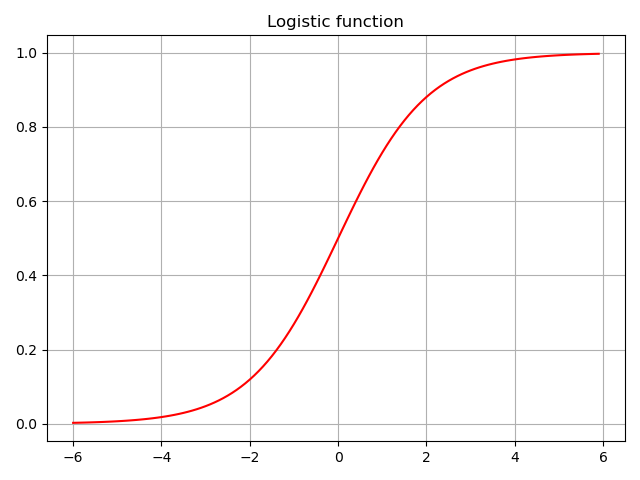

# Chapter 6: From Linear to Logistic Regression

Previously, we discussed simple, multiple, and polynomial linear regression. These models are special cases of **generalized linear model**, a flexible framework that requires fewer assumptions than ordinary linear regression.
- here we discuss these assumptions as they relate to **logistic regression** (another special case of generalized linear model).
	- logistic regression is used for classification tasks
	- recall that goal of classification tasks is to induce a function that maps an observation to its associated class or label
- a learning algorithm must use pairs of feature vectors and their corresponding labels to induce values of mapping function's parameters that produce best classifier, as measured by some performance metric
	- in binary classification, classifier must assign instances to one of two classes
	- in multi-class classification, classifier must assign one of several labels to each instance
	- in multi-label classification, classifier must assign a subset of labels to each instance
- in this chapter, **we work on several classification problems using logistic regression**
	- discuss performance measures for classification task
	- apply some feature extraction techniques in [Chap. 4: Feature Extraction](../chap-04-feature-extraction/).

## 6.1 Binary classification with logistic regression

Ordinary linear regression assumes that response variable is normally distributed.
- **normal distribution** (or **Gaussian distribution**) is a function that describes probability that an observation will have a value between any two real numbers
	- normally distributed data is symmetrical
	- half values are greater than mean and half are less than mean
	- many natural phenomena are approximately normally distributed, *i.e.*,
		- height of people is normally distributed, most people are of average height, a few are tall, and a few are short
	- response variable for some problems is not normally distributed, *i.e.*,
		- a coin toss can result in two outcomes: heads or tails
- **bernoulli distribution** describes probability distribution of a random variable that can take positive case with probability *P* or negative case with probability *1-P*.
	- if response variable represents a probability, it must be constrained to [0, 1]

Linear regression assumes that a constant change in value of a feature results in a constant change in value of response variable, an assumption that cannot hold if value of response variable represents a probability.
- generalized linear models remove this assumption by relating a linear combination of features to response variable using a link function.
	- we have already used a link function in [Chap. 2: Simple Linear Regression](../chap-02-simple-linear-regression/chap-02-simple-linear-regression.md)
	- ordinary linear regression is a special case of generalized linear model that links a linear combination of features to a normally distributed response variable using identity function
	- we can use a different link function to relate a linear combination of features to a response variable that is not normally distributed

In logistic regression, response variable describes probability that outcome is positive case. 
- if response variable is equal to or exceeds a discrimination threshold, positive class is predicted; otherwise, negative class is predicted
- response variable is modeled as a function of a linear combination of features using **logistic function**
	- logistic function always returns a value between 0 and 1: $F(t)=\frac{1}{1+e^{-t}}$
	- following plot of value of logistic function for range [-6, 6]
	- for logistic regression, *t=* a linear combination of explanatory variables as $F(t)=\frac{1}{1+e^{-(b+wx)}}$
	- - **logit function** is inverse of logistic function
		- it links $F(x)$ back to a linear combination of features $g(x) = ln\frac{F(x)}{1-F(x)} = b + wx$
		- model's parameters can be estimated using a variety of learning algorithms, including gradient descent

## 6.2 Spam filtering

Our first problem is a modern version of canonical binary classification problem: spam filtering.
- we will classify spam and ham sms messages rather than e-mail
- we will extract tf-idf features from messages using techniques shown in previous chapters, and classify messages using logistic regression
- we use *SMS Spam Collection Data Set* from *UCI Machine Learning Repository*.
	- download dataset from [HERE](http://archive.ics.uci.edu/dataset/228/sms+spam+collection)

==**Tutorial: 1-sms-spam-collection.ipynb**==

First explore dataset and calculate basic summary statistics using pandas
- `df.head()`
- `df[df[0] == 'spam'][0].count()`
	- each row comprises a binary label and a text message
	- dataset contains 5574 instances; 4825 messages are *ham* and remaining 747 are *spam*

We make some predictions using scikit-learn's `LogisticRegresion` class.
- 1st split dataset into training and test sets. default `train_test_split` assigns 75% samples to training
- 2nd create a `TfidfVectorizer`,which combines `CountVectorizer` and `TfidfTransformer`
	- we fit it with training messages and transform both training and test messages
- 3rd create an instance of `LogisticRegression` and train the model
	- `LogisticRegression` implements `fit` and `predict` methods
- linear regression performs bad
- below we discuss some performance metrics to evaluate binary classifiers

### 6.2.1 Binary classification performance metrics

A variety of metrics exist for evaluating performance of binary classifiers against trusted labels.
- most common metrics are accuracy, precision, recall, F1 measure, and ROC AUC score.
- all depend on concept of true positives, true negatives, false positives, and false negatives
- positive and negative refer to classes
- true and false denote whether predicted class is same as true class
	- for SMS spam classifier
	- a true positive prediction is when classifier correctly predicts that a message is spam
	- a true negative prediction is when classifier correctly predicts that a message is ham
	- a prediction that a ham message is spam is a false positive prediction
	- a spam message incorrectly classified as ham is a false negative prediction
- a **confusion matrix**, or contingency table, to visualize true and false positives and negatives
	- rows of matrix are true classes of instances, columns are predicted classes of instances

:::danger
:::
