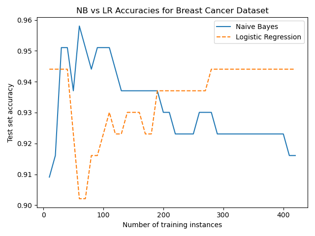
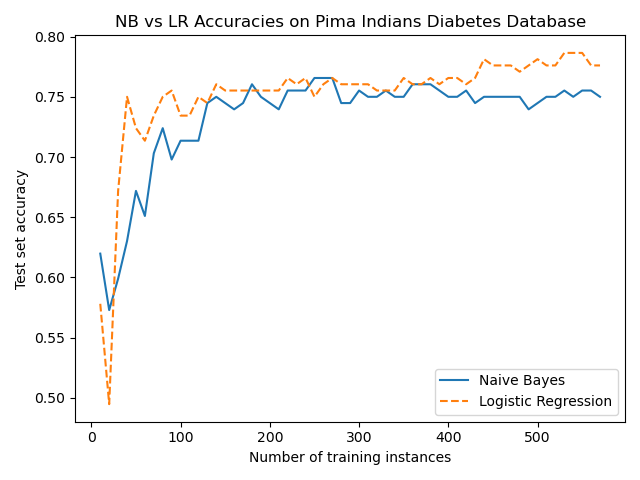

# Chapter 7: Naive Bayes

Previous chapters introduced two models for classification tasks: kNN and logistic regression.
- here introduce another family of classifiers called Naive Bayes
- named for its use of Bayes' theorem and for its naive assumption that all features are conditionally independent of each other given response variable, Naive Bayes is 1st generative model to discuss
	- 1st introduce Bayes' theorem
	- 2nd compare generative and discriminative models
		- we will discuss Naive Bayes and its assumptions and examine its common variants
		- we will fit a model using scikit-learn

## 7.1 Bayes' theorem

**Bayes' theorem** is a formula for calculating probability of an event using prior
knowledge of related conditions.
- theorem was discovered by Thomas Bayes in 18th century
- Bayes never published his work; his notes were edited and published posthumously by mathematician Richard Price
- Bayes' theorem is given by formula $P(A|B) = \frac{P(B|A)P(A)}{P(B)}$ 
	- A and B are events
	- $P(A)$ is probability of observing event A, and $P(B)$ is the probability of observing event B
	- $P(A|B)$ is conditional probability of observing A given that B was observed
- in classification tasks, our goal is to map features of explanatory variables to a discrete response variable; we must find most likely label, A, given features, B

We work through an example
- assume that a patient exhibits a symptom of a particular disease, and that a doctor administers a test for that disease
- this test has been found to have 99% recall and 98% specificity
	- **specificity** measures true negative rate, or proportion of truly negative instances that were predicted to be negative 
	- specificity and recall are often used to evaluate medical tests
	- **recall is sometimes called sensitivity**
		- 99% recall means that 99% patients who truly have disease were predicted to have it
		- 98% specificity means that 98% patients who truly do not have disease were predicted not to have it
- also assume that disease is rare, probability that a person in population has it is only 0.2%
- if a patient's test result is positive, what is probability that she actually has disease?
- what is conditional probability of having disease, A, given a positive test result, B?

We can solve this using Bayes' theorem if we know values of terms $P(A)$, $P(B)$, and $P(B|A)$. - $P(A)$ is probability of having disease, which we know to be 0.2%
- $P(B|A)$, or probability of a positive test result given that patient has disease, is test's recall, 0.99
- $P(B)$, probability of a positive test result, it equals to sum of probabilities of true and false positive results
	- $P(positive) = P(positive|disease)P(disease) + P(positive|not-disease)P(not-disease)$
	- here $not-disease$ is a single symbol, not a difference
- probability of a positive test result given that patient has disease = test's recall, 0.99
- probability of this outcome is product of test's recall and probability of having disease, 0.002
- probability of a positive test result given that patient does not have disease is complement of test's specificity, or 0.02
- probability of this outcome is product of complement of test's specificity, 0.02, and complement of probability of having disease, 0.998
- $P(positive) = 0.99*0.002 + 0.02*0.998 = 0.022$

Following is Bayes' theorem re-written in terms of our events:
- $P(disease|positive) = \frac{P(positive|disease)P(disease)}{P(positive|disease)P(disease) + P(positive|not-disease)P(not-disease)}$
- we solve for all terms, and can now solve for conditional probability of
having disease given a positive test result
- $P(disease|positive) = \frac{0.99*0.002}{0.99*0.002+0.02*0.998} = 0.09$
- probability that a patient who tests positive truly has disease is less than 10%
- this seems incorrect
- test's recall and specificity were 99% and 98%, respectively; it is not intuitive that a patient who tests positive is much more likely not to have disease
- while test's specificity and recall are similar, false positives are much more frequent than false negatives because probability of having disease is very small
- in a population of 1000 patients, we expect only 2 to have disease
- with 99% recall, we should expect test to correctly detect these two patients
- however, we should also expect test to incorrectly predict that almost 20 other patients have disease
- only 9% of 22 positive predictions are true positives

## 7.2 Generative and discriminative models

In classification tasks, our goal is to learn parameters of a model that optimally maps
features of explanatory variables to response variable.
- all classifiers discussed before are **discriminative models**
	- which learn a decision boundary that is used to discriminate between classes
- *probabilistic discriminative models*, such as logistic regression, learn to estimate conditional probability $P(y|x)$
	- they learn to estimate which class is most likely given input features
- *non-probabilistic discriminative models*, such as KNN, directly map features to classes

**Generative models** do not directly learn a decision boundary.
- they model joint probability distribution of features and classes, $P(x,y)$
- this is equivalent to modelling probabilities of classes and probabilities of features given classes
- that is, generative models model how classes generate features
- Bayes' theorem can then be applied to a generative model to estimate conditional probability of a class given features

If our goal in classification tasks is to map features to classes, why would we use an
approach that requires an intermediate step?
- why choose a generative model instead of a discriminative model?
- one reason is that generative models can be used to generate new examples of data
- more important, generative models can be more biased than their discriminative counterparts because they model how classes generate data
- this intermediate step introduces more assumptions to model
- when these assumptions hold, generative models are more robust to noisy training data and may perform better than discriminative models when training data is scarce
	- disadvantage is that these assumptions can prevent generative models from learning
- discriminative models generally perform better than generative models as number of training instances increases

## 7.3 Naive Bayes

### 7.3.1 What is Naive Bayes

In 1st section, Bayes' theorem is given by $P(A|B) = \frac{P(B|A)P(A)}{P(B)}$ 
- we rewrite Bayes' theorem in terms that are more natural for a classification task
	- $P(y|x_1, ... x_n) = \frac{P(x_1, ..., x_n|y)P(y)}{P(x_1, ..., x_n)}$
	- y is positive class
	- $x_1$ is 1st feature for instance, and $n$ is number of features
	- $P(B)$ is constant for all inputs, so we can omit it
		- probability of observing a particular feature in training set does not vary for different test instances
	- this leaves two terms
		- prior class probability, $P(y)$
		- conditional probability, $P(x_1, ..., x_n|y)$
- Naive Bayes estimates these terms using maximum a posteriori estimation
	- $P(y)$ is simply frequency of each class in training set
	- for categorical features, $P(x_i|y)$ is simply frequency of feature in training instances belonging to that class
		- its estimate is given by $\hat{P}(x_i|y_i) = \frac{N_{x_i, y_j}}{N_{y_j}}$
        - numerator is number of times that feature appears in training samples of class $y_j$
		- denominator is total frequency of all features for class $y_j$
- Naive Bayes predicts class with greatest probability, as given by
	- $\hat{y} = argmax_y P(y)\Pi_{i=1}^n P(x_i|y)$
	- note that even when a Naive Bayes classifier performs well, estimated class probabilities can be poorly calibrated
	- the variants of Naive Bayes differ mostly in their assumptions about distribution of $P(x_i|y)$, and therefore types of features that they can learn from
- the variant we have discussed
- **multinomial Naive Bayes**, is suitable for categorical features
	- our term frequency features represent each token in a corpus as a categorical variable
- **Gaussian Naive Bayes** is suitable for continuous features
	- it assumes that each feature is normally distributed for each class
- **Bernoulli Naive Bayes** is suitable when all features are binary-valued
	- scikit-learn's `GaussianNB`, `BernoulliNB`, and `MultinomialNB` classes implement these variants

### 7.3.2 Assumptions of Naive Bayes

Model is called Naive because it assumes that features are conditionally independent given response variable $P(x_i | y) = P(x_i | y, x_j)$
- note that this is not equivalent to assuming that features are independent, as given by $P(x_i) = P(x_i | x_j)$.
- this independence assumption is seldom true
- however, Naive Bayes can effectively discriminate between linearly separable classes even when this assumption is violated, and often performs better than discriminative models when training data is scarce
- in addition to performing well, Naive Bayes models are typically fast and simple to implement

Consider an article classification task for a news site.
- given an article, our goal is to assign it to a newspaper section, such as "International Politics", "U.S. Politics", "Science and Technology" or "Sports"
- Naive Bayes assumption means that knowing that an article belongs to sports section and knowing that article contains word "basketball" does not affect your beliefs about whether words "Warriors" or "UNC" appear in article
- this assumption does not hold in this task
	- knowing that an article is from "Sports" section and that it contains word "basketball" should make us believe that it is more likely to contain words "UNC", "NCAA", and "Michael Jordan", and less likely to contain unrelated words such as "sandwich" or "meteor"
	- knowing that an article belongs to sports section and contains word "Duke" should make us more believe that it is more likely to contain words "trip" and "flop"
- while Naive Bayes assumption seldom holds, it is necessary
- model would have an impractical number of parameters without it, and it allows class conditional probabilities to be estimated directly from training data

Naive Bayes also assumes that training instances are **independent and identically distributed (i.i.d)**
- this means that training instances are independent from each other and are drawn from same probability distribution
- repeatedly tossing a coin produces i.i.d. samples
	- probability of each flip landing heads is same, and outcome of any flip does not depend on outcome of any other flip
- unlike conditional independence assumption, this assumption must hold for Naive Bayes to perform well

## 7.4 Naive Bayes with scikit-learn

**Tutorial 1: 1-performance-NB-LR.ipynb**

### 7.4.1 Breast Cancer Dataset

We fit a Naive Bayes classifier with scikit-learn, and compare performances of Naive Bayes and logistic regression classifiers on increasingly large samples of two different training sets.
- we use Breast Cancer Wisconsin dataset consisting of features extracted from fine needle aspirate images of breast masses
	- task is to classify masses as malignant or benign using 30 real-valued features that describe cell nuclei in each fine needle aspirate image
	- dataset has 212 malignant instances and 357 benign instances
- Pima Indians Diabetes Database task is to predict whether an individual has diabetes using eight features representing number of times individual has been pregnant, measures from an oral glucose tolerance test, diastolic blood pressure, triceps skin fold thickness, body mass index,
age, and other diagnostics
	- dataset has 268 diabetic instances and 500 non-diabetic instances

We start with Breast Cancer Wisconsin dataset
- load dataset using scikit-learn's `load_breast_cancer` convenience function
- split off 20% instances to use as a test set using `train_test_split` convenience function
- `stratify=y` specifies that training and test sets should have equal proportions of positive and negative instances
	- this is important when classes are imbalanced, as sampling instances uniformly at random could result in a training or testing set with few instances of minority class
- use `train_test_split` again to take increasingly large slices of remaining instances
	- and use them to train `LogisticRegression` and `GaussianNB` classifiers
- finally plot classifiers' scores

Naive Bayes classifiers often outperform logistic regression classifiers on small datasets
- Naive Bayes is more biased, which prevents it from overfitting noise
	- however, this bias also can also stunt model's learning on large datasets
- ==Naive Bayes classifier initially performs better than logistic regression classifier, but logistic regression classifier's performance improves as size of training set increases==

### 7.4.2 Pima Indians Diabetes Database

We compare performances of logistic regression and Naive Bayes classifiers on Pima Indians Diabetes Database
- use pandas to load csv file
- csv file lacks a header row, so we split response variable from features using column indices
- next to create a stratified test set
- again train and evaluate models on increasingly large samples of training set, and plot accuracies
- ==Naive Bayes classifier is more accurate than the logistic regression classifier on small datasets, but accuracy of logistic regression classifier continues to improve as size of dataset increases==

:::danger
:::
