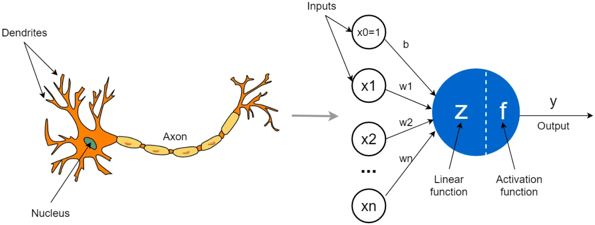

# Chapter 10: Perceptron

We have discussed linear models such as multiple linear regression and logistic regression.
- here we introduce another linear model for binary classification tasks called **perceptron**
- while perceptron is seldom used today, understanding it and its limitations is important in order to understand models in following chapters

## 10.1 Perceptron

### 10.1.1 Neuron and perceptron

Invented by Frank Rosenblatt at Cornell Aeronautical Laboratory in late 1950s, development of perceptron was originally motivated by efforts to simulate human brain.
- a brain is composed of cells called **neurons** that process information
- connections between neurons are called **synapses**, through which information is transmitted
- human brain has been estimated to be composed of as many as 100 billion neurons and 100 trillion synapses
- as illustrated below, main components of a neuron are dendrites, a body, and an axon
	- dendrites receive electrical signals from other neurons
	- signals are processed in neuron's body, which then sends a signal through axon to another neuron

An individual neuron can be thought of as a computational unit that processes one or more inputs to produce an output.
- a perceptron functions analogously to a neuron, it accepts one or more inputs, processes them, and returns an output
- a model of just one of hundreds of billions of neurons in human brain will be of limited use, that is true
- a single perceptron is incapable of approximating many functions
- however, we will still discuss perceptrons for two reasons
	- 1st, perceptrons are capable of online learning
		- learning algorithm can update model's parameters using a single training instance rather than entire batch of training instances
		- online learning is useful for learning from training sets that are too large to be represented in memory
	- 2nd, understanding perceptron and its limitations is necessary for understanding some powerful models in subsequent chapters, including support vector machines and artificial neural networks

Perceptrons are commonly visualized using a diagram shown above.
- circles labeled $x_1$, $x_2$, and $x_m$ are input units, and each input unit represents one feature
- perceptrons frequently use an additional input unit that represents a constant bias term, but this input unit is usually omitted from diagrams
- circle in center is a computational unit, or neuron's body
- edges (arrows) connecting input units to computational unit are analogous to dendrites
- each edge (arow) is associated with a parameter, or weight
	- parameters can be interpreted easily
	- a feature that is correlated with positive class will have a positive weight
	- a feature that is correlated with negative class will have a negative weight
- edge directed away from computational unit returns output (right circle), and can be thought of as axon

### 10.1.2 Activation functions

Perceptron classifies instances by processing a linear combination of features and model parameters using an activation function:
$$
y = \phi (\sum_{i=1}^n w_i x_i + b)
$$
- $w_i$ are model's parameters, $b$ is a constant bias term, $\phi$ is activation function
- a linear combination of parameters and inputs is sometimes called **preactivation**
- several different activation functions are commonly used
	- Rosenblatt's original perceptron used Heaviside step function
	- Heaviside step function is also called unit step function as $g(x) = 1 (x>0) and 0 (others)$
		- x is weighted combination of features
		- if weighted sum of features and bias term > 0, activation function returns 1 and perceptron predicts that instance is positive class
		- otherwise, function returns 0 and perceptron predicts that instance is negative class
	- another common activation function is logistic sigmoid $g(x) = \frac{1}{1+e^{-x}}$
		- $x$ is weighted sum of inputs
		- unlike unit step function, logistic sigmoid is differentiable
		- this difference will become important when discuss artificial neural networks

### 10.1.3 Perceptron learning algorithm

Perceptron learning algorithm begins by setting weights to zero, or to small random values, and then predicts class for a training instance.
- perceptron is an error-driven learning algorithm
	- if prediction is correct, algorithm continues to next instance
	- if incorrect, algorithm updates weights
	- formally, update rule is given by $w_i(t+1) = w_i(t) + \alpha(d_j-y_j(t))x_{j,i}$
	- for each training instance, parameter value for each feature is incremented by $\alpha(d_j-y_j(t))x_{j,i}$
		- $d_j$ is true class for instance $j$, $y_j(t)$ is predicted class for instance $j$
		- $x_{j,i}$ is value of ith feature for instance $j$
		- $\alpha$ is a hyperparameter that controls learning rate
	- if prediction is correct, $d_j-y_j(t)=0$, and $\alpha(d_j-y_j(t))x_{j,i} = 0$
		- that is, if prediction is correct, weight is not updated
		- if prediction is incorrect, we compute $d_j-y_j(t)$, value of feature, and learning rate
		- then add product (which may be negative) to weight

This update rule is similar to update rule for gradient descent in that weights are adjusted towards classifying instance correctly and size of update is controlled by a learning rate.
- each pass through training instances is called an **epoch**
- learning algorithm has converged when it completes an epoch without misclassifying any instances
- learning algorithm is not guaranteed to converge
	- later will discuss linearly inseparable datasets for which convergence is impossible
	- for this reason, learning algorithm also requires a hyperparameter that specifies maximum number of epochs that can be completed before algorithm terminates

:::danger
:::
