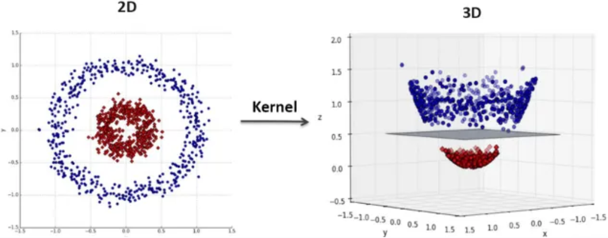

# Chapter 11: Perceptron to Support Vector Machines

Previous Chap., we introduced perceptron and described why it cannot effectively classify linearly inseparable data.
- recall that we encountered a similar problem in discussion on multiple linear regression
	- we examined a dataset in which response variable was not linearly related to explanatory variables
	- to improve model accuracy, we introduced a special case of multiple linear regression called polynomial regression
	- we created synthetic combinations of features, and were able to model a linear relationship between response variable and features in higher dimensional feature space
	- while this method of increasing dimensions of feature space may seem like a promising technique to use when approximating nonlinear functions with linear models, it suffers from two related problems
		- 1st is a computational problem; computing mapped features and working with larger vectors requires more computing power
		- 2nd problem pertains to generalization; increasing dimensions of feature representation exacerbates curse of dimensionality
	- learning from high-dimensional feature representations requires exponentially more training data to avoid overfitting

This Chap., we discuss a powerful discriminative model for classification and regression, called **support vector machine (SVM)**.
- 1st revisit mapping features to higher dimensional spaces
- 2nd discuss how SVMs mitigate computation and generalization problems encountered when learning from data mapped to highdimensional spaces
	- entire books are devoted to describing SVMs, and describing optimization algorithms used to train SVMs requires more advanced math than we have used in previous chapters
	- instead of working through simple examples in previous chapters, we try to develop an intuition of how SVMs work in order to apply them effectively with scikit-learn

## 11.1 Kernels and kernel trick

Recall that perceptron separates instances of positive class from instances of negative class using a hyperplane as a decision boundary.
- decision boundary is given by formula: $f(x) = <w, x> + b$
- predictions are made using following function $h(x) = sign(f(x))$
- while proof is beyond scope of this chapter, we write model differently
	- expression we used previously is **primal** form
	- following expression of model is called the **dual** form
		- $f(x) = <w,x>+b = \sum \alpha_i y_i <x_i, x> + b$
	- **important difference between primal and dual forms** is that primal form computes inner product of model parameters and test instance's feature vector
	- while dual form computes inner product of training instance's and test instance's feature vector
	- later we will exploit this property of dual form to work with linearly inseparable classes

1st, we must formalize our definition of mapping features to higher dimensional spaces.
- in *polynomial regression* section, we mapped features to a higher dimensional space in which they were linearly related to response variable
- mapping increased number of features by creating quadratic terms from combinations of original features
- these synthetic features allowed us to express a nonlinear function with a linear model
- in general, a mapping is given by $x \arrow \phi(c)$ and $\phi: R^d \arrow R^D$
- left plot in following figure shows original feature space of a linearly inseparable dataset
- right plot on shows that data is linearly separable after mapping to a higher dimensional space

:::danger
:::
