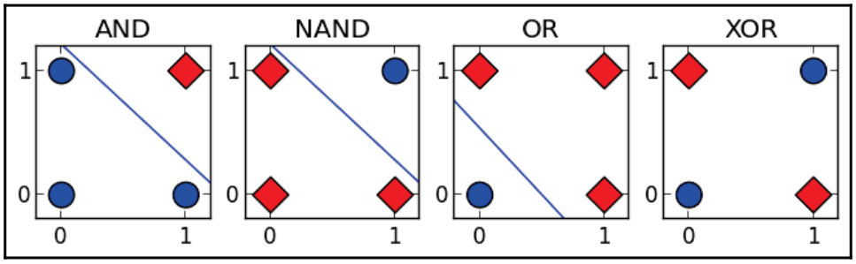

# Chapter 12: From Perceptron to Artificial Neural Networks

- In [Chap. 10](../chap-10-perceptron/chap-10-perceptron.md) we introduced perceptron, a linear model for binary classification
	- we learned that perceptron is not a universal function approximator
	- its decision boundary must be a hyperplane
- In [Chap. 11](../chap-11-perceptron-2-SVM/chap-11-perceptron-2-SVM.md) we introduced SVM, which addresses some perceptron's limitations by using kernels to efficiently map feature representations to a higher dimensional space in which classes may be linearly separable.
- In this chapter, we discuss ANNs, powerful nonlinear models for supervised and unsupervised tasks that use a different strategy to overcome perceptron's limitations.
	- if perceptron is analogous to a neuron, an ANN is analogous to a brain
	- as billions of neurons with trillions of synapses comprise a human brain, an ANN is a directed graph of artificial neurons
		- graph's edges are weighted, and these weights are model parameters that must be learned

This chapter provide an overview of structure and training of small, feed-forward artificial neural networks.
- scikit-learn implements neural networks for classification, regression, and feature extraction
	- however these implementations are suitable for only small networks
- training neural networks is computationally expensive
	- in practice, most neural networks are trained using GPU with thousands of parallel processing cores
	- scikit-learn does not support GPUs, and it is not likely to do so in near future
- training neural networks is better served by purpose-built libraries such as Caffe, TensorFlow, and Keras than generalpurpose machine learning libraries such as scikit-learn
	- we will not use scikit-learn to train deep **Convolutional Neural Networks (CNN)** for object recognition or recurrent networks for speech recognition, understanding workings of small networks is an important prerequisite for these tasks

## 12.1 Nonlinear decision boundaries

Recall that while some Boolean functions such as AND, OR, and NAND can be approximated by perceptron, the linearly inseparable function XOR cannot
- we review XOR in detail to develop an intuition of power of ANN
- in contrast to AND (outputs 1 when both inputs = 1) and OR ( outputs 1 when at least one input = 1), output of XOR is 1 when exactly one of its inputs = 1
- we view XOR as outputting 1 when two conditions are true
	- 1st is that at least one input must be = 1; this is same condition that OR tests
	- 2nd is that inputs cannot both = 1; NAND tests this condition
- we can produce same output as XOR by processing input with both OR and NAND, and then verifying that outputs of both functions are equal to 1 using AND
	- that is, functions OR, NAND, and AND can be composed to produce same output as XOR

| A | B | A AND B | A NAND B | A OR B | A XOR B |
|:-:|:-:|:-------:|:--------:|:------:|:-------:|
| 0 | 0 | 0       | 1        | 0      | 0       |
| 0 | 1 | 0       | 1        | 1      | 1       |
| 1 | 0 | 0       | 1        | 1      | 1       |
| 1 | 1 | 1       | 0        | 1      | 0       |

Above figure provides truth tables for XOR, OR, AND, and NAND for inputs A and B.
- we can verify that inputting output of OR and NAND to AND produces same output as inputting A and B to XOR

| A | B | A OR B | A NAND B | (A OR B) AND (A NAND B) |
|:-:|:-:|:------:|:--------:|:-----------------------:|
| 0 | 0 | 0      | 1        | 0                       |
| 0 | 1 | 1      | 1        | 1                       |
| 1 | 0 | 1      | 1        | 1                       |
| 1 | 1 | 1      | 0        | 0                       |

Instead of trying to represent XOR with a single perceptron, we will build an ANN from multiple artificial neurons that each approximate a linear function.
- each instance's feature representation will be input to two neurons
- one neuron will represent NAND and the other will represent OR
- the output of these neurons will be received by a third neuron that represents AND to test that both of XOR's conditions are true

:::danger
:::
