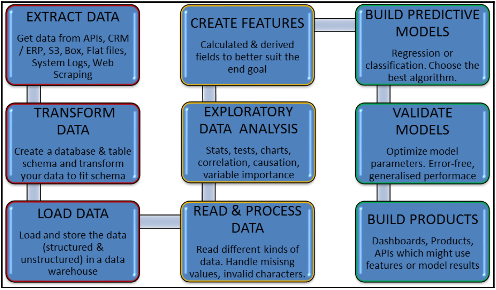

# Chap. 1: Introduction to pandas and Data Analysis

This chapter covers context, origin, history, market share, and current standing of pandas, and are divided into the following headers:
- Motivation for data analysis
- How Python and pandas can be used for data analysis
- Description of the pandas library
- Benefits of using pandas

## 1. Motivation for data analysis

The term big data has become one of the hottest technology buzzwords in past two years.
- we now increasingly hear about big data in various media outlets, and big data startups have increasingly been attracting venture capital.
- loosely speaking, big data refers to a phenomenon wherein amount of data exceeds capability of recipients of data to process it.
- an article on big data: https://www.oracle.com/in/big-data/guide/what-is-big-data.html

A good way to start thinking about complexities of big data is called four dimensions, or **Four V's of big data**
- this model was first introduced as three V's by Gartner analyst Doug Laney in 2001
	- three V's stood for Volume, Velocity, and Variety
	- Gartner's official definition states following *Big data is high volume, high velocity, and/or high variety information assets that require new forms of processing to enable enhanced decision making, insight discovery and process optimization* -- Laneh, Douglas. "The Importance of 'Big Data': A Definition", Gartner
- fourth V, Veracity, was added later by IBM

Volume of big data
- volume of data in big data age is simply mind-boggling
- according to IBM, by 2020, total amount of data on planet will have ballooned to 40 zettabytes
- growth rate of data has been fuelled largely by a few factors, such as rapid growth of internet, conversion from analog to digital media, coupled with an increased ability to capture and store data, which in turn has been made possible with cheaper and better storage technology

Velocity of big data
- from a purely technological point of view, velocity refers to throughput of big data, or how fast data is coming in and is being processed
- this has ramifications on how fast recipient of data needs to process it to keep up
- real-time analytics is one attempt to handle this characteristic 

Variety of big data
- variety of big data comes from having a multiplicity of data sources that generate data and different formats of data that are produced
- this results in a technological challenge for recipients of data who have to process it
- digital cameras, sensors, web, cell phones, and so on are some data generators that produce data in differing formats, and challenge is being able to handle all these formats and extract meaningful information from these data.

Veracity of big data
- it was added later—refers to need to validate or confirm orrectness of data or fact that data represents truth
- sources of data must be verified and errors kept to a minimum

So much data, so little time for analysis
- data analytics has been described by Eric Schmidt, the former CEO of Google, as Future of Everything.
- a YouTube video called [Why Data Analytics is the Future of Everything]()
- technologies and tools have evolved to meet the ever-increasing demands of business, there has been a move towards **real-time analytics**

## 2. Data analytics pipeline

Data modeling is the process of using data to build predictive models.
- data can also be used for descriptive and prescriptive analysis.
- before we make use of data, it has to be fetched from several sources, stored, assimilated, cleaned, and engineered to suit our goal
- sequential operations that need to be performed on data are akin to a manufacturing pipeline, where each subsequent step adds value to potential end product and each progression requires a new person or skill set
- various steps in a **data analytics pipeline** are shown in following diagram:

These steps can be combined into three high-level categories: **data engineering**, **data science**, and **product development**
- data Engineering (steps 1-3): it deals with sourcing data from a variety of sources, creating a suitable database and table schema, and loading data in a suitable database. there can be many approaches to this step depending on
	- type of data: structured (tabular data) vs unstructured (such as images and text) vs semi-structured (such as JSON and XML)
	- velocity of data upgrade: batch processing vs real-time data streaming
	- volume of data: distributed (or cluster-based) storage vs single instance databases
	- variety of data: document storage, blob storage, or data lake
- data Science (steps 4-8): it is phase where data is made usable and used to predict future, learn patterns, and extrapolate these patterns
	- data science can further be subdivided into two phases
	- steps 4-6 comprise 1st phase, wherein goal is to understand data better and make it usable
		- making data usable requires considerable effort to clean it by removing invalid characters and missing values
		- it also involves understanding nitty-gritty of data at hand—what is distribution of data, what is relationship between different data variables, is there a causatory relationship between input and outcome variable, ...
		- it also involves exploring numerical transformations (features) that might explain this causation (between input and outcome variables) better
		- this phase entails real forensic effort that goes into ultimate use of data
	- steps 7-8 constitute part where patterns (parameters of a mathematical expression) are learned from historic data and extrapolated to future data
		- it involves a lot of experimentation and iterations to get to optimal results
		- but if previus phase has been done with utmost care, this phase can be implemented pretty quickly thanks to number of packages in Python, R, and many other data science tools
- product Development: this is phase where all hard work bears fruit and all insights, results, and patterns are served to users in a way that they can consume, understand, and act upon
	- it might range from building a dashboard on data with additional derived fields to an API that calls a trained model and returns an output on incoming data

Apart from these steps in pipeline, there are some additional steps that might come into picture, which is due to highly evolving nature of data landscape.
- *i.e.*, deep learning, which is used extensively to build intelligent products around image, text, and audio data, often requires training data to be labeled into a category or augmented if quantity is too small to create an accurate model

## 3. What is Pandas?

[Pandas](https://pandas.pydata.org/) is a high-performance open source library for data analysis in Python developed by Wes McKinney in 2008.
- pandas stands for **panel data**, a reference to tabular format in
which it processes data
- it is available for free and is distributed with a 3-Clause BSD
License under open source initiative
- over years, it has become de-facto standard library for data analysis using Python
- there's been great adoption of tool, and there's a large community behind it, (1200+ contributors, 17000 commits, 23 versions, and 15000+ stars) rapid iteration, features, and enhancements are continuously made

Some key features of pandas include:
- it can process a variety of datasets in different formats: time series, tabular heterogeneous, and matrix data
- it facilitates loading/importing data from varied sources, such as CSV and databases such as SQL
- it can handle myriad operations on datasets: subsetting, slicing, filtering, merging, groupBy, re-ordering, and re-shaping
- it can deal with missing data according to rules defined by user/developer, such as ignore, convert to 0, and so on
- it can be used for parsing and munging (conversion) of data as well as modeling and statistical analysis
- it integrates well with other Python libraries such as statsmodels, SciPy, and scikit-learn
- it delivers fast performance and can be sped up even more by making use of Cython (C extensions to Python)
- for more information, go through official pandas [documentation](https://pandas.pydata.org/docs/)

:::danger
:::
